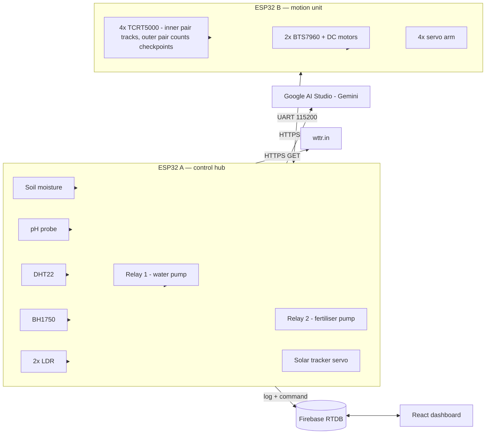
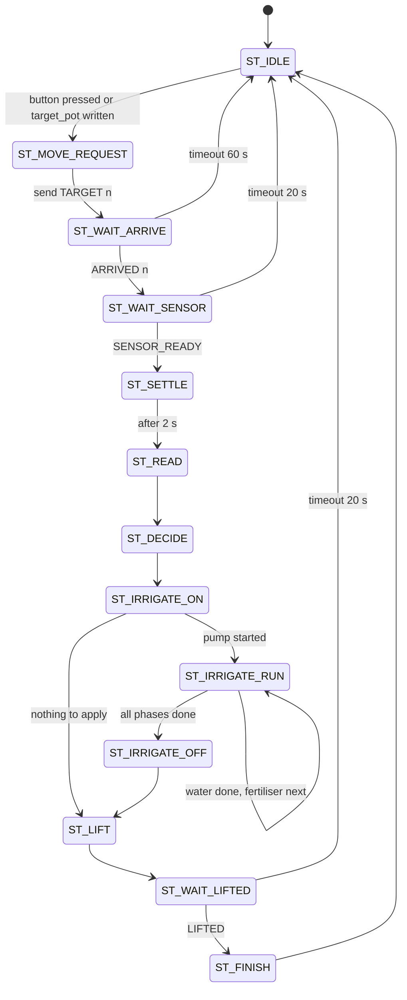
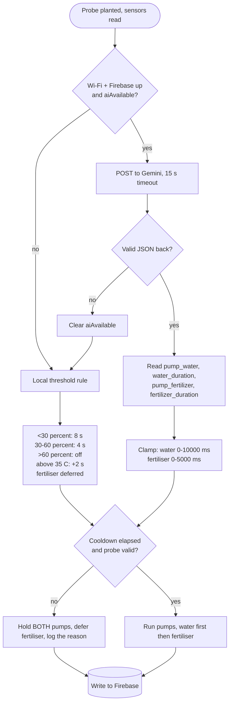
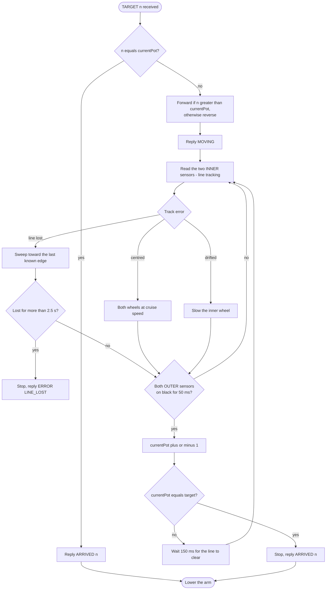
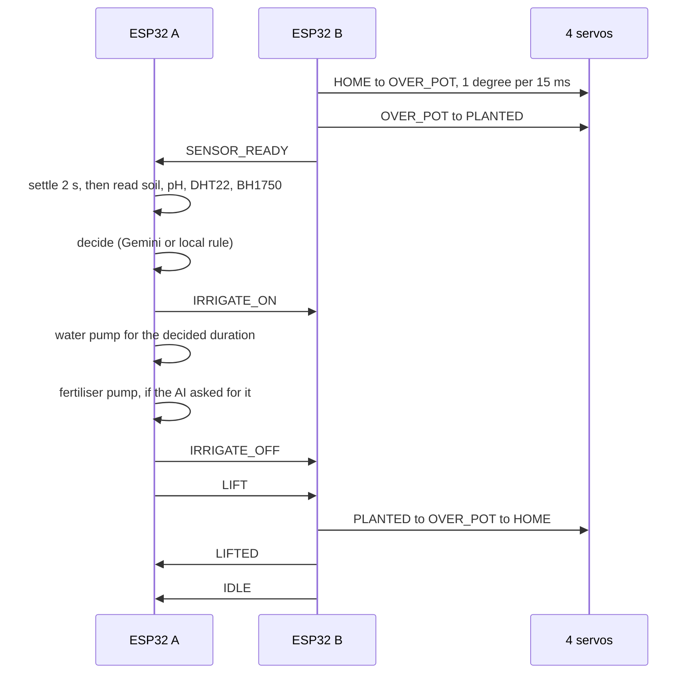
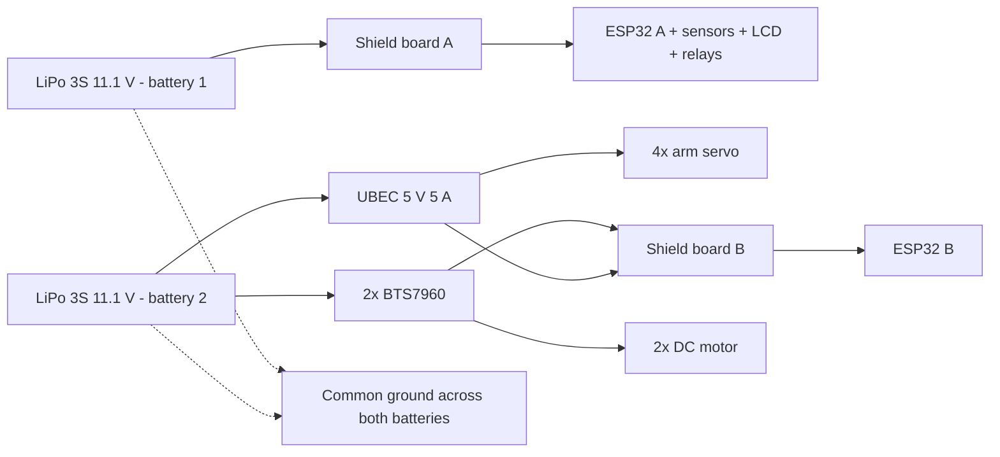

# Aqua-M V2 — Flowcharts

Mermaid diagrams. They render on GitHub as-is; for the paper or a poster, paste
any block into <https://mermaid.live> and export SVG or PNG.

---

## 1. System overview

Note the shape of it: the AI call is a direct edge from ESP32 A to Gemini.
Firebase never sits in that path.

---

## 2. Mission state machine — ESP32 A

Network work happens only in `ST_IDLE` and `ST_DECIDE`. Pumps only run in
`ST_IRRIGATE_RUN`. The two sets never overlap, so a slow API call cannot stretch
a watering cycle.

---

## 3. Irrigation decision

---

## 4. Navigation — ESP32 B

Sensor roles: the **inner** pair follows the track, the **outer** pair detects
the perpendicular checkpoint lines. The outer pair sits off the track and only
reads black at a crossing, which is what makes the count reliable.

The 150 ms clear-window is what stops one thick line being counted several
times as the robot rolls over it.

Reverse moves use the same diagram, but see section 15 of `AquaM_ESP32_B.ino`:
with the sensor bar at the front, the correction loop is unstable in reverse.

---

## 5. Arm sequence

---

## 6. Power distribution

Two batteries, one per ESP32, so motor and servo current cannot brown out the
logic. The grounds are still tied together — without a shared reference the UART
link between the two boards will not work.
